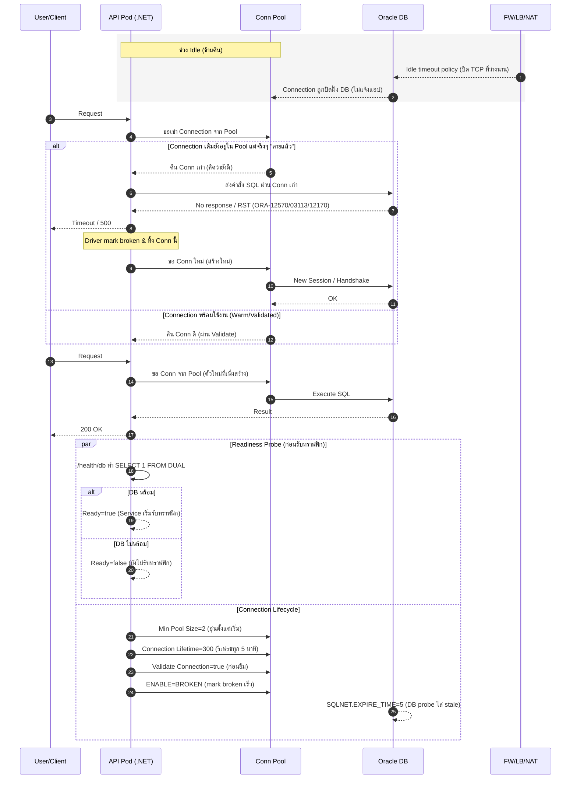

# How to Fix "First Request Timeout" on AKS (.NET 8 + Oracle + Dapper) 

**Best Practices — การแก้ปัญหา Call แรก Timeout บน AKS (.NET + Oracle + Dapper)**
# 

## บทนำ (Introduction)

ในการพัฒนา Microservices ที่รันบน **Azure Kubernetes Service (AKS)** และเชื่อมต่อฐานข้อมูล Oracle ผ่าน .NET WebAPI + Dapper เราพบปัญหาที่เกิดซ้ำบ่อยมากคือ:

> ❗ **เมื่อไม่มี Traffic เข้ามาระยะหนึ่ง (เช่นค้างคืน) การ Call ครั้งแรกจะ Timeout**
> ส่วนใหญ่เกิดในตอนเช้าของวัน หรือหลังการ Deploy / Restart Pod

แม้คำสั่ง SQL จะถูก และ Performance DB อยู่ในระดับปกติ แต่แอปพลิเคชันยังเจอ Timeout ― สาเหตุไม่ได้อยู่ที่ SQL แต่เป็นการจัดการ **Connection Pooling + Network Idle Timeout + Stale Connection** ใน container/Kubernetes environment

บทความนี้จะสรุป Best Practices สำหรับ Dev เพื่อแก้ปัญหา **call แรก Timeout** โดยเรียงลำดับ:

1. ✅ สาเหตุของปัญหา
2. ✅ ผลกระทบที่เกิดขึ้น
3. ✅ แนวทางแก้ไข (พร้อมโค้ด และ connection string)

# 

## เนื้อหา (Detail)

# 

### ✅ 1. สาเหตุของปัญหา (Root Causes)

| สาเหตุ                                                              | อธิบาย                                                                                                                   |
| ------------------------------------------------------------------- | ------------------------------------------------------------------------------------------------------------------------ |
| **Stale / Broken Connection ใน Connection Pool**                    | แอปไม่ได้ใช้งาน connection นาน → Oracle/Firewall ปิด TCP แต่ Pool ของ .NET ยังคิดว่ายังใช้งานได้ → หยิบมาใช้แล้ว Timeout |
| **Cold Start ของ Pod บน AKS**                                       | หลัง Restart/Scale Pod ใหม่ → Load assembly, JIT, Dapper mapping, สร้าง connection pool ยังไม่ได้ init                   |
| **ไม่มี Min Pool Size**                                             | Pool เริ่มที่ 0 connection → Call แรกต้องเสียเวลา Build connection                                                       |
| **ไม่มี Validate Connection ก่อนใช้**                               | แอปหยิบ connection ที่ตายแล้วขึ้นมาใช้ โดยไม่ได้ตรวจสอบ                                                                  |
| **Network Idle Timeout จาก Firewall / Load Balancer / NAT Gateway** | Idle TCP connection ถูก Kill                                                                                             |
| **ไม่มี Readiness Probe**                                           | Pod พร้อมรับทราฟฟิก แต่ Connection DB ใช้ไม่ได้                                                                          |

# 
### Sequence Diagram

แสดงลำดับเหตุการณ์ (Timeline) ของการเชื่อมต่อระหว่าง API บน AKS → Connection Pool → Oracle DB และ Network (Firewall/LB/NAT) เพื่อให้เห็นว่า ทำไม “Call แรก” จึง Timeout และ เกิดอะไรขึ้นหลังจากการแก้ปัญหา


 

### คำอธิบาย Sequence Diagram

### 🔹 ส่วนที่ 1: Idle ช่วงข้ามคืน (ปัญหากำลังก่อตัว)
 

| องค์ประกอบ                     | ความหมาย                                                                          |
| ------------------------------ | --------------------------------------------------------------------------------- |
| **API Pod**                | ตัว .NET Web API ที่รันอยู่บน AKS                                                 |
| **Connection Pool (.NET)** | ที่เก็บ Connection ให้ reuse ลดเวลาสร้าง connection ใหม่                          |
| **Oracle DB**              | ระบบฐานข้อมูล                                                                     |
| **FW/LB/NAT**              | Firewall, Load Balancer และ NAT Gateway (network layer) ที่มี Idle Timeout Policy |

**สิ่งที่เกิดขึ้นจริงในช่วง Idle:**

* แอปไม่ได้ยิง query นานหลายชั่วโมง (เช่นตอนกลางคืน)
* Firewall / Load Balancer / NAT Gateway มี policy “ตัด TCP ที่นิ่งนาน”
* Oracle DB เลยปิด connection ฝั่ง DB → แต่ **ไม่ได้แจ้งกลับมายัง .NET**
* ใน Connection Pool ของ .NET ยัง “เก็บ connection ไว้เหมือนเดิม” และ **คิดว่ายังใช้ได้**

> อันนี้คือ “Stale / Broken Connection” ซึ่งเป็นสาเหตุหลักของ First Call Timeout

# 

### 🔹 ส่วนที่ 2: Request ครั้งแรกของวัน (เช้า) → Timeout
 

**ลำดับเหตุการณ์**

1. User เรียก API ครั้งแรก → API ขอ connection จาก pool
2. Pool หยิบ connection เก่า → **แต่จริงๆ connection นั้นตายแล้ว**
3. API ส่ง SQL → DB ไม่ตอบ / TCP reset → เกิด error เช่น:

   * `ORA-12570: Network Session: Unexpected packet read`
   * `ORA-03113: end-of-file on communication channel`
   * `ORA-12170: TNS:Connect timeout occurred`
4. API Timeout → ส่ง HTTP `500`
5. .NET driver จะ mark connection ว่า broken และสร้าง connection ใหม่

> นั่นคือเหตุผลที่ **Call ครั้งแรก timeout แต่ Call ครั้งต่อไปสำเร็จ**

# 

### 🔹 ส่วนที่ 3: Request ถัดไป → สำเร็จ
 

ตอนนี้ connection ใหม่นั้นสดและดี → ไม่มีปัญหาอีก

# 

### 🔹 ส่วนที่ 4: แนวทางป้องกัน (Happy Path หลัง tuning)
 

| Best Practice              | ทำหน้าที่                                   |
| -------------------------- | ------------------------------------------- |
| `Min Pool Size=2`          | อุ่น connection ตั้งแต่ Pod start           |
| `Connection Lifetime=300`  | ตัด connection ที่อยู่นานเกิน               |
| `Validate Connection=true` | ตรวจ connection ก่อนยืม                     |
| `ENABLE=BROKEN`            | Mark connection ที่ตายแล้วให้ discard ทันที |
| `SQLNET.EXPIRE_TIME=5`     | DB probe connection ที่ stale               |

**ผลลัพธ์:**
✅ ไม่มี stale connection ใน pool
✅ Pod จะรับ Traffic เฉพาะเมื่อ DB พร้อม
✅ First Call จะเร็วและไม่ timeout

# 

# สรุปใจความสำคัญ

| ปัญหา              | สาเหตุจริง                                                          |
| ------------------ | ------------------------------------------------------------------- |
| ❌ Call แรก Timeout | Connection Pool มี connection ที่ตายแล้ว (stale)                    |
| ✅ วิธีแก้          | Warm pool + Validate connection + readinessProbe + Broken Detection |

# 
### ✅ 2. ผลกระทบ (Impact)

| ผลกระทบ                             | รายละเอียด                                  |
| ----------------------------------- | ------------------------------------------- |
| ❌ Call แรก Timeout → API Return 500 | ผู้ใช้งานปลายทาง error                      |
| ❌ Dev เข้าใจผิดว่า SQL ช้า          | ทั้งที่ปัญหาเกิดก่อนถึง DB                  |
| ❌ การตรวจสอบเหตุการณ์ทำได้ยาก       | ไม่มี Log ที่บ่งชี้ connection ค้าง         |
| ❌ สร้าง Load แปลกปลอมบน DB          | มีการสร้าง connection burst หลังจาก timeout |

# 

### ✅ 3. การแก้ไข (Best Practices)
  

#### ✅ 3.1 ปรับ Connection String (แก้ปัญหาหลัก)

> จุดสำคัญคือ: **Warm pool + Validate connection + Kill stale connection**

ตัวอย่าง connection string **แนะนำให้ใช้**

```ini
Pooling=true;
Min Pool Size=2;
Max Pool Size=50;
Incr Pool Size=5;
Decr Pool Size=2;
Connection Lifetime=300;
Validate Connection=true;
Statement Cache Size=50;
Data Source=(DESCRIPTION=(ENABLE=BROKEN)
            (ADDRESS=(PROTOCOL=TCP)(HOST=xxx)(PORT=1521))
            (CONNECT_DATA=(SERVICE_NAME=GISPROD)));
```

| คีย์                       | ทำหน้าที่                                         |
| -------------------------- | ------------------------------------------------- |
| `ENABLE=BROKEN`            | ทำให้ driver ตรวจพบ connection ที่ตายแล้วเร็วขึ้น |
| `Min Pool Size=2`          | อุ่น connection pool ตั้งแต่ start app            |
| `Connection Lifetime=300`  | ตัด stale connection ทุก 5 นาที                   |
| `Validate Connection=true` | เช็ค connection ก่อนใช้งานจริง ลด Timeout         |


### ตัวอย่าง ConnectionStrings
```ini
...
 "ConnectionStrings": {
   "Receipts": "User Id={UserDB};Password={UserDB_Passwrod};Data Source=(DESCRIPTION=(ENABLE=BROKEN)(ADDRESS=(PROTOCOL=TCP)(HOST={HOST})(PORT=1521))(CONNECT_DATA=(SERVICE_NAME={SERVICE_NAME})));Connection Timeout=120;Pooling=true;Min Pool Size=2;Max Pool Size=50;Incr Pool Size=5;Decr Pool Size=2;Connection Lifetime=300;Validate Connection=true;Statement Cache Size=50;Load Balancing=false;HA Events=true;"
 },
...
 ```
### การนำไปใช้งาน แทนค่าจริงในพารามิเตอร์

> User Id=**{UserDB}**
> Password=**{UserDB_Passwrod}**
> SERVICE_NAME=**{SERVICE_NAME}**

# 

#### ✅ 3.2 ปรับโค้ด (.NET + Dapper)

> ห้ามเก็บ connection ไว้เป็น Singleton / Scoped

```csharp
await using var conn = new OracleConnection(ConnectionString);
await conn.OpenAsync(cancellationToken);

var result = await conn.QueryAsync<T>(sql, param);
```
# 

#### ✅ 3.3 เพิ่ม Readiness Probe (AKS)

> เพื่อให้ Pod รับ Traffic **เฉพาะตอน DB พร้อม**

เพิ่มใน `deployment.yaml`

```yaml
readinessProbe:
  httpGet:
    path: /health/db
    port: 8080
  initialDelaySeconds: 5
  periodSeconds: 10
  timeoutSeconds: 3
  failureThreshold: 3
```

สร้าง endpoint `/health/db` ให้ยิง `SELECT 1 FROM DUAL`

# 

#### ✅ 3.4 Require DBA Config

ให้ DBA เพิ่มใน `sqlnet.ora` ของ Oracle Server:

```
SQLNET.EXPIRE_TIME = 5
```

ช่วย detect dead TCP connection → ทำให้ connection pool ไม่ค้าง

# 

### ✅ 3.5 Monitoring & Logging

ควร Log

| Metric                                  | ใช้ตรวจสอบอะไร                     |
| --------------------------------------- | ---------------------------------- |
| เวลาเปิด Connection (`OpenAsync()`)     | ช้าเพราะ network / connection pool |
| จำนวน Connection Active                 | ใช้ monitor Idle/High Load         |
| Error ORA-12570 / ORA-03113 / ORA-12170 | บอกว่ามี broken connection         |

# 

## บทสรุป (Conclusion)

| สรุปสั้น ๆ                                                                                                |
| --------------------------------------------------------------------------------------------------------- |
| ปัญหา Timeout ครั้งแรกไม่ได้เกิดจาก SQL แต่เกิดจาก **Stale Connection + Cold Pool + Idle Timeout บน AKS** |
| แนวทางแก้คือ **Warm pool + Validate connection + Readiness Probe + ลบ connection ที่ stale**              |
| เมื่อปรับค่าตามบทความนี้ จะลด timeout ครั้งแรกจาก **10–30 วินาที → เหลือ < 500ms**                        |


## เอกสารอ้างอิง

https://statics.teams.cdn.office.net/evergreen-assets/safelinks/2/atp-safelinks.html
#  
## 👨‍💻 Author

> *  Nuchito-นุชิโตะ
> *  2025-11-08 
